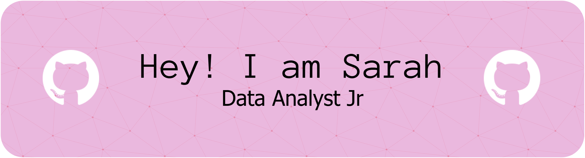

# Hello, I'm Sarah 💗☕👋

### I'm currently a International Relations student 📊🌎 with a background in data analysis 💻🔍. I am passionate about analyzing data within a broader social or political context. 

## 🎯 2026 mission, Find a part-time job i will love.

## Technical Skills (STACK)🛠️🧰

#### Data Analysis & Management: 
- Excel / 
- SQL / 
- Python / 
- R

#### Data Visualization & Storytelling: 
- Tableau 
- Python Visualization Libraries (Matplotlib / Seaborn)

#### Workplace Environment:
- Git & GitHub
- Jupyter Notebooks
- VS Code

## Soft Skills 💎
-  Analytical Thinking (Pensamiento analítico)
- ⭐ Problem Solving (Resolución de problemas)
- 📣 Effective Communication (Comunicación efectiva)
- 🚀 Teamwork (Trabajo en equipo)
- ✅ Results-Oriented (Orientación a resultados)
- 💥 Organization (Organización)
- 🦾 Proactivity (Proactividad)
- 🧠 Attention to Detail (Atención al detalle)
- 🍀 Process Optimization (Optimización de procesos)

### How to reach me: 🌐
-  LinkedIn: www.linkedin.com/in/sarah-moscoso
-  Gmail: sarahmoscoso15@gmail.com
-  Github: https://github.com/saramozun
<!--
**saramozun/saramozun** is a ✨ _special_ ✨ repository because its `README.md` (this file) appears on your GitHub profile.

Here are some ideas to get you started:

- 🔭 I’m currently working on ...
- 🌱 I’m currently learning ...
- 👯 I’m looking to collaborate on ...
- 🤔 I’m looking for help with ...
- 💬 Ask me about ...
- 📫 How to reach me: ...
- 😄 Pronouns: ...
- ⚡ Fun fact: ...
-->
